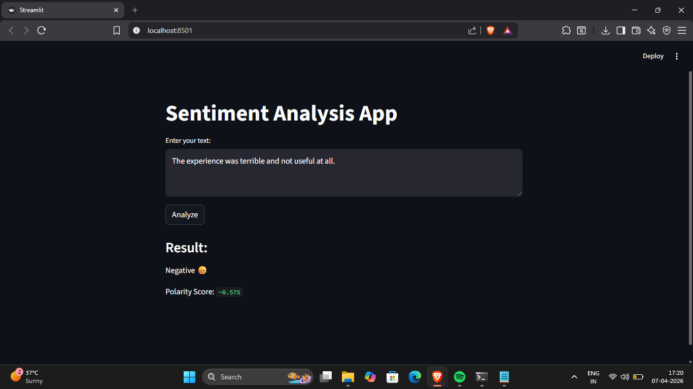

# Sentiment Analysis Project

## Description

This project performs sentiment analysis on text data to classify it as positive, negative, or neutral. It uses Natural Language Processing (NLP) techniques to calculate the polarity of the input text.

## Technologies Used

* Python
* TextBlob
* Jupyter Notebook

##  How It Works

1. User provides input text
2. Text is processed and analyzed
3. Polarity score is calculated
4. Output is classified as Positive, Negative, or Neutral

## Example

Input: "I love this product"
Output: Positive 😊
Polarity: 0.8

Input: "This is bad"
Output: Negative 😞
Polarity: -0.7

## Output Screenshot

##  Project Structure

* sentiment-analysis.ipynb → Main notebook implementation
* sentiment.py → Application file 
* requirements.txt → Required libraries
* output.png → Sample output screenshot

##  How to Run

1. Install dependencies
2. Open the notebook or run the Python file
3. Enter your own text to analyze sentiment

## Future Improvements

* Build a web app using Streamlit
* Use advanced NLP models
* Improve accuracy with larger datasets

## Author

Tangella Madhumitha

